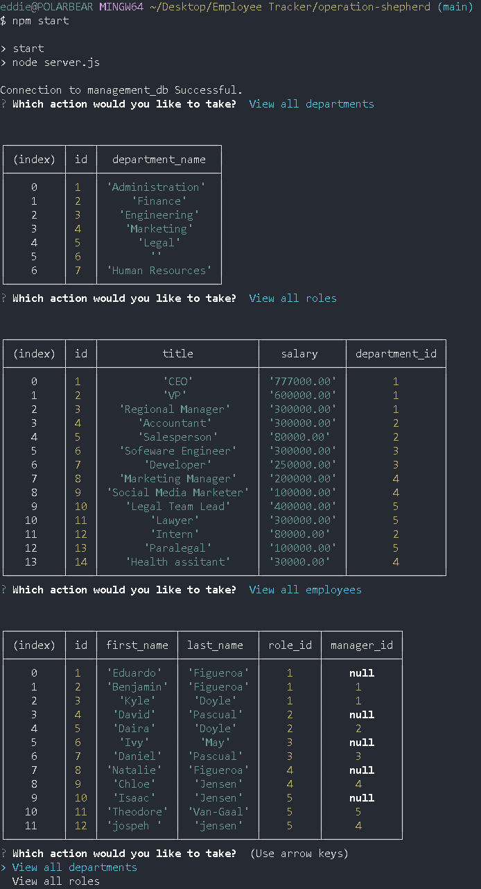

# operation-shepherd

## Description
This Application allows a user to mange the employee structure of a business. You can view and add different departments, roles and employees. In addition a user can update en employees role in the business. 

## Table of Contents
* [Description](#description)
* [Technologies](#technologies)
* [Installation](#installation)
* [Usage](#usage)
* [Preview](#preview)
* [Contributors](#contributors)
* [Contact](#contact)

## Technologies 
* JavaScript
* HTML
* Node
* express.js
* MySQl
* Sequelize
* Dotenv

## Installation 
1. Clone repository from github 
2. Node.js must be installed
3. Install Express.js using the integrated terminal 
4. Install npm packages and other dependencies by inputting ` "npm i" `in the terminal
5. The dependencies you will use for this application include but are not limited to: mysql2, inquirer, sequelize, dotenv & express.

## Usage
Navigate to db/connection.js file and input your own sql user and password. Run database, schema and seeds files by running the following commands in mysql shell. `"source db/schema.sql"` and then `"source db/seeds.sql"`. One that is done, exit out of the mysql shell. Then run `"node server.js"` into the terminal to be prompted with the applications questions.
 
 

## Preview

 
 

## Video 
[Walk-through Video](https://drive.google.com/file/d/1ZT2sNoQgEnLEbwZrC8izjzeTOokW42MD/view)

## Contributors
To contribute to operation-wordsmith, clone this repo locally and commit your code in a separate branch

Contributors:

Made with [contrib.rocks](https://contrib.rocks).

## Contact
Eduardo Figueroa
* Github: https://github.com/eddiefigueroa18
* Email: eddiefigueroa18@gmail.com

